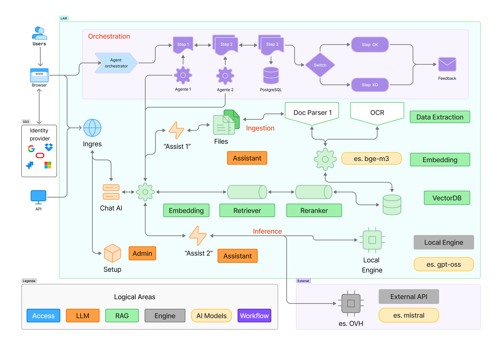
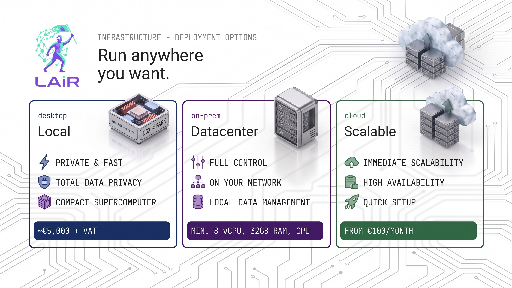

<p align="center">
  
</p>

<p align="center">
  <strong>LAiR - Private AI Infrastructure & Process Automation Platform</strong><br>
  LAiR is the complete private AI stack you self-host: models, automation and tools running entirely on your own servers. No big player, no lock-in.

</p>

[](https://opensource.org/license/gpl-3.0)
[]()
[]()
[](CONTRIBUTING.md)
[](https://github.com/Lair-ai/lair/issues)
[](https://github.com/Lair-ai/lair/stargazers)

**Created by [NEXiD s.r.l.](https://www.nexid.it)** 

---

## Table of Contents

- [What is Lair?](#what-is-lair)
- [Why Private AI Matters](#why-private-ai-matters)
- [Architecture Overview](#architecture-overview)
- [Quick Start](#quick-start)
- [Installation Paths](#installation-paths)
- [Edge AI & DGX Spark](#edge-ai--desktop-supercomputing-nvidia-jetson--dgx-spark)
- [Deployment Scenarios](#deployment-scenarios)
- [Platform Support & Smart Features](#platform-support--smart-features)
- [Quick Commands](#quick-commands)
- [Current Limitations](#current-limitations)
- [Roadmap](#future-roadmap)
- [Documentation](#documentation)
- [Contributing](#contributing)
- [Code of Conduct](#code-of-conduct)
- [Security](#security)
- [Support & Community](#support--community)
- [License](#license)
- [About](#about)
- [Acknowledgements](#acknowledgements)

---

## What is Lair?

Lair enables organizations to deploy **private AI infrastructure** with comprehensive **process automation capabilities** on Kubernetes. The default architecture is fully self-hosted for data sovereignty and control; optional external AI providers can be enabled when needed.

---

## Why Private AI Matters

<p align="center">
  
</p>

When you use a Big closed AI provider, your data — documents, code, customer records — goes to someone else's servers. You can't control where it's stored or how it's used.

**LAiR changes that.** It gives you the same AI tools, but running on infrastructure you control. Privacy depends on how you deploy:

- **LAN / On-premises** (DGX Spark or PC with GPU) — Everything runs locally. Models, data, and automations stay on your hardware. Zero data leaves your network.
- **Datacenter / Cloud** (VM or managed Kubernetes) — Your data stays within your controlled environment. If no GPU is available, LAiR can use external LLM providers for inference. In this case, choose providers carefully: **European providers** are recommended for GDPR compliance, and since multiple users share the same API endpoint, there is no individual profiling.

### What do you need to do?

Deploy LAiR on a server you control — a physical machine in your office, a VM in the cloud, an edge device, or even a desktop workstation like NVIDIA DGX Spark. See [Quick Start](#quick-start) for installation instructions.

### What do you get?

- **A private ChatGPT** — A web interface (OpenWebUI) where your team can chat with AI, upload documents, search knowledge bases, all running locally
- **Local LLMs** — Open-source models served by Ollama on your own GPU, from small and fast to 200B+ parameters on DGX Spark
- **External LLM support** — When no GPU is available, connect to open-source model providers (e.g. OVH AI Endpoints). Choose European providers for GDPR compliance. No user profiling — the API is shared, not tied to individual accounts.
- **Workflow automation** — N8N with 400+ integrations to connect AI to your ERP, CRM, databases, email, and more
- **Document intelligence** — Upload PDFs, Word files, spreadsheets. LAiR extracts and indexes them for AI-powered search (RAG)
- **Image generation** — ComfyUI for AI-generated images, running on your GPU
- **Your own SSO** — Log in with your company credentials (Azure AD, Google, OIDC)
- **Full control** — Every component runs on your infrastructure. No vendor lock-in, no per-token billing.

### Who is it for?

| If you are... | LAiR helps you... |
|---------------|-------------------|
| A company handling sensitive data (healthcare, finance, legal, government) | Use AI without violating compliance rules or sending data outside |
| A team that wants to automate internal processes | Build AI-powered workflows that connect to your existing systems |
| An organization already running Kubernetes | Add a complete AI stack to your existing cluster |
| Deploying at the edge (retail, manufacturing, IoT) | Run AI where your data is generated, not in a distant cloud |
| Tired of unpredictable AI costs | Pay for hardware once, use AI unlimited — no per-token billing |

### How do you use it?

1. **Deploy** — Follow the [Quick Start](#quick-start) guide to install LAiR on your server.
2. **Access** — Open the web UI at `ai.your-domain.local` (or your public domain). Log in with your company SSO or local credentials.
3. **Chat** — Start talking to AI. Pick a model, upload documents, ask questions.
4. **Automate** — Open N8N, build workflows that connect AI to your business tools — no coding required.
5. **Scale** — Add more nodes, more GPUs, more models. LAiR grows with your needs.

> **In short:** LAiR lets you run a complete AI platform on your own terms. Same power as cloud AI, but your data stays yours, your costs are predictable, and you're in full control.

---

## Architecture Overview

### High-Level Overview 



Lair consists of three main components that work together to provide a complete AI infrastructure:

### 1. Cluster Setup (`microk8s/` or `k8s-managed/`)
- **MicroK8s Setup**: Install and configure Kubernetes clusters (single-node or multi-node) optimized for AI workloads
- **Multi-Node Support**: Scale from single-node development to multi-node production clusters
- **Managed K8s Setup**: Configure existing Kubernetes clusters (OVH MKS, EKS, GKE, AKS, etc.)
- **Platform Detection**: Automatic optimization for x86_64, ARM64, and NVIDIA Jetson
- **Network Configuration**: Smart dual-IP handling for Cloud vs On-Premises scenarios
- **Storage & Backup**: Distributed Longhorn (multi-node) or Hostpath (Jetson), with Velero backup integration

### 2. Application Deployment (`helm-chart/`)
- **Interactive Configuration**: Guided setup with resource detection and optimization
- **Multi-Access Modes**: LAN (`.local` domains) and Public (internet domains) with automatic TLS
- **Resource Management**: Intelligent allocation based on available CPU, memory, and storage
- **Component Selection**: Enable/disable services based on your needs and resources

### 3. Access & Integration
- **LAN Access**: `.local` domains with optional HTTPS via mkcert certificates
- **Public Access**: Internet domains with automatic Let's Encrypt certificates
- **API Integration**: All services expose APIs for custom integrations
- **Backup & DR**: Automated backups to S3-compatible storage with Velero

### Components

#### Applications

| Component | Purpose | Default Access |
|-----------|---------|----------------|
| **OpenWebUI** | Private ChatGPT-like interface with RAG and extended features | `ai.hostname.local` |
| **N8N** | Workflow automation and API orchestration | `n8n.hostname.local` |
| **Ollama** | Local LLM serving platform | Internal API |
| **Tika** | Document processing and text extraction | Internal API |
| **ComfyUI** | AI image generation interface | `images.hostname.local` |
| **MinIO** | S3-compatible object storage | `storage.hostname.local` |
| **PostgreSQL** | Database backend for OpenWebUI and N8N | Internal API |
| **Redis** | Cache/queue backend for OpenWebUI and N8N | Internal API |

#### Cluster Infrastructure

| Component | Purpose | Default Access |
|-----------|---------|----------------|
| **ingress-nginx** | Ingress controller / reverse proxy for exposed services | Via app hostnames |
| **cert-manager** | Certificate lifecycle management in Kubernetes | Internal API |
| **Let's Encrypt** | Public TLS certificate issuer (through cert-manager) | Internal API |
| **Longhorn** | Distributed block storage for persistent volumes | Internal API |
| **Velero** | Backup and restore for cluster resources and volumes | Internal API |
| **CoreDNS** | Internal Kubernetes service discovery and DNS | Internal API |
| **MetalLB** | LoadBalancer IP allocation for bare-metal/local clusters | Internal API |

#### Host/LAN Tools (Optional)

| Component | Purpose | Default Access |
|-----------|---------|----------------|
| **dnsmasq** | Local LAN DNS resolution for `*.hostname.local` | Host/LAN service |
| **mkcert** | Local trusted certificates for LAN domains | Local host tool |

---

## Quick Start

### Prerequisites

| Requirement | Minimum | Recommended |
|-------------|---------|-------------|
| **OS** | Ubuntu 24.04 LTS | Ubuntu 24.04 LTS / DGX OS |
| **CPU** | 4 cores | 8+ cores |
| **RAM** | 8 GB | 16+ GB |
| **Storage** | 100 GB free | 200+ GB free |
| **Access** | Root/sudo | Root/sudo |

> **8 GB RAM limitation:** The 8 GB tier is only supported if you disable local models (Ollama) and image generation (ComfyUI).

### Simplified Installation (Recommended)

```bash
# 1. Clone repository
git clone https://github.com/Lair-ai/lair.git
cd lair

# 2. Run the interactive setup wizard
sudo ./setup.sh
```

> **WARNING:** The setup wizard performs system-level changes including installing Kubernetes, creating persistent volumes, and configuring networking. **Do not run this on a production system without first reviewing the scripts and understanding the impact.** Always test in a non-critical environment first. See [Current Limitations](#current-limitations) for known issues.

**The setup wizard will:**
- Welcome you and explain the process
- Ask whether you want to setup a cluster or deploy Lair
- Guide you through cluster choice (managed vs local MicroK8s)
- Run the appropriate setup scripts interactively
- Handle the complete setup process step by step

**That's it!** Your private AI infrastructure is ready with guided assistance.

> **Backup & Restore:** LAiR includes [Velero](https://github.com/vmware-tanzu/velero) for automated backup and disaster recovery. Cluster resources and persistent volumes can be backed up to S3-compatible storage and restored when needed. See [Backup & Disaster Recovery](docs/maintenance/backup-restore.md) for details.

---

## Installation Paths

The unified setup wizard (`sudo ./setup.sh`) automatically detects your environment and guides you through the appropriate installation path. It supports the following main deployment scenarios:

1. **Local MicroK8s (Recommended)**
   - **Single-node**: Perfect for development, cloud VMs, edge computing (Jetson), and DGX Spark.
   - **Multi-node**: Setup a primary node and secondary workers for production/high availability.
2. **Managed Kubernetes (Enterprise)**
   - Deploy on existing clusters like OVH MKS, EKS, GKE, or AKS.

For advanced users who prefer manual execution or need granular control over each step, detailed guides and scripts are available in the [Installation Documentation](docs/installation/).

<p align="center">
  
</p>

> **Note 1:** The DGX Spark cost of approximately €5,000 is current as of June 2026.
>
> **Note 2:** When installing on a machine without a GPU, you will need to account for token costs from open-source model providers of your choice.
---

## How to evaluate Lair

The easiest and most cost-effective way to evaluate Lair is using a VPS in the internal data center or in a cloud provider. You will need a couple of subdomain names and an external AI provider (we recommend OVH or equivalent open-source Provider)

Please, follow instructions in the [Tutorial to start](docs/Tutorial%20to%20Start.md) to deploy Lair on a VPS


## Edge AI & Desktop Supercomputing: NVIDIA Jetson & DGX Spark

LAiR runs on compact edge devices (NVIDIA Jetson) and desktop AI systems (NVIDIA DGX Spark), enabling production-grade AI workflows outside traditional datacenters.

### NVIDIA DGX Spark — Desktop AI Supercomputer

The DGX Spark is powered by the **NVIDIA GB10 Grace Blackwell Superchip** and brings datacenter-class AI compute to a Mac mini-sized desktop form factor. Lair is validated to run on DGX Spark, enabling very high‑end single-node private AI deployments.

| Specification | DGX Spark |
|---------------|-----------|
| **Chip** | NVIDIA GB10 Grace Blackwell Superchip |
| **CPU** | 20-core ARM (10× Cortex-X925 + 10× Cortex-A725) |
| **GPU** | Blackwell with 5th-gen Tensor Cores |
| **AI Performance** | 1 PFLOP (sparse FP4) |
| **Memory** | 128 GB unified (CPU + GPU shared) |
| **Bandwidth** | 273 GB/s |
| **Max model size** | ~200B parameters (single) / ~405B (two units via ConnectX) |
| **OS** | DGX OS (Ubuntu 24.04-based) |
| **Architecture** | ARM64 |
| **Power** | 240W |

**DGX Spark + Lair: key benefits**
- Run **70B parameter models in FP16** on a single unit — no multi-GPU cluster required
- **128 GB unified memory** reduces system-to-VRAM data transfer overhead
- Full **CUDA acceleration** with PyTorch, Ollama, vLLM, and ComfyUI
- Keep your AI stack **fully on-premise** for data privacy and sovereignty
- Build on **open-source components** without SaaS lock-in
- Improve **cost control** for sustained workloads versus token-based cloud billing

**System Requirements & Hardware Setup**

To ensure optimal performance, stability and proper power management when running LAiR, your DGX Spark operating system, software components and base firmware must be fully up to date. 

You can update these components by following the [official NVIDIA OS and Component Update Guide](https://docs.nvidia.com/dgx/dgx-spark/os-and-component-update.html).

### DGX Spark Quick Start

Run the unified setup wizard directly on your DGX Spark (running DGX OS / Ubuntu 24.04 ARM64). The wizard will guide you through the same installation flow as any other supported Ubuntu host.

### NVIDIA Jetson — Edge AI

For deployments at the network edge, LAiR runs on all NVIDIA Jetson devices with automatic ARM64 optimizations.

### What Runs on Both Platforms

| Component | Jetson | DGX Spark |
|-----------|--------|-----------|
| OpenWebUI | ✅ | ✅ |
| N8N | ✅ | ✅ |
| Ollama | ✅ | ✅ *(up to 200B params)* |
| ComfyUI | ✅ | ✅ |
| PostgreSQL | ✅ | ✅ |
| Kubernetes (MicroK8s) | ✅ | ✅ |
| Multi-node clustering | ❌ | ✅ *(via ConnectX)* |

---

## Deployment Scenarios

Here are some common deployment scenarios and how to configure them:

### Private AI Development Lab (LAN Mode)
- **Environment**: Office environments, internal development, secure networks, DGX Spark workstations.
- **Wizard Choices**: Choose **Cluster Setup (MicroK8s)** -> **Single-node**, and select **LAN access** when prompted.

### Edge AI Deployment (NVIDIA Jetson)
- **Environment**: Manufacturing, Retail, Agriculture, Security (air-gapped or restricted networks).
- **Wizard Choices**: The platform automatically detects the Jetson hardware. Choose **Cluster Setup (MicroK8s)** -> **Single-node**, and select **LAN access**.

### Cloud Public Deployment (OVHCloud or AWS, GCP, Azure)
- **Environment**: Cloud VMs where a public IP is assigned directly to the instance.
- **Wizard Choices**: Choose **Cluster Setup (MicroK8s)** -> **Single-node**, and select **Public access** to automatically configure internet routing and Let's Encrypt certificates.

### On-Premises Public Access (Router/NAT Setup)
- **Environment**: Home servers, office setups with router port forwarding, VPS with NAT.
- **Wizard Choices**: Choose **Cluster Setup (MicroK8s)** -> **Single-node**, select **Public access**, and provide your router's public IP when prompted for the external IP.

### Enterprise Managed Kubernetes (OVH MKS / EKS / GKE / AKS)
- **Environment**: Existing enterprise K8s infrastructure.
- **Wizard Choices**: Choose **Cluster Setup (Managed K8s)** to install required infrastructure components, then proceed to the **Deploy Lair application** step.

---

## Platform Support & Smart Features

### Platform Support

| Platform | Architecture | Networking | Storage | GPU | Multi-Node |
|----------|-------------|-----------|---------|-----|-----------|
| **x86_64** | x86_64 | Calico | Longhorn | NVIDIA (optional) | ✅ |
| **NVIDIA Jetson** | ARM64 | Flannel | Hostpath | Tegra | ❌ |
| **NVIDIA DGX Spark** | ARM64 | Calico | Longhorn | GB10 Blackwell |  ✅ *(via ConnectX)*  |
| **Cloud Instances** | x86_64 | Calico | Longhorn | NVIDIA (optional) | ✅ |

### Smart Features
- **Intelligent Scenario Detection** — Automatically detects and optimizes for Cloud vs On-Premises deployments
- **Smart Dual-IP Configuration** — Native optimization for NAT/router scenarios with separate internal/external IP handling
- **Auto-GPU Detection** — Automatic NVIDIA GPU configuration on supported platforms
- **Automatic Internet Connectivity** — Pod-to-internet routing for model downloads
- **Multi-Architecture** — Works on x86_64, ARM64, NVIDIA Jetson, NVIDIA DGX Spark
- **Storage Optimization** — Platform-specific storage solutions (Longhorn vs Hostpath)
- **Remote Cluster Access** — Optional remote kubectl access with automatic kube-apiserver configuration

---

## Quick Commands

### MicroK8s Deployments
```bash
microk8s status # Check system status
kubectl get pods -n lair # View all services
kubectl get ingress -n lair # Check service URLs
kubectl logs -n lair deployment/openwebui # View logs
sudo ./microk8s/teardown.sh # ⚠ DESTROYS all LAiR data, volumes, and namespaces — irreversible
```

### Managed Kubernetes Deployments
```bash
kubectl cluster-info # Check cluster status
kubectl get pods -n lair # View all services
kubectl get ingress -n lair # Check service URLs
kubectl logs -n lair deployment/openwebui # View logs
sudo ./k8s-managed/teardown.sh # ⚠ DESTROYS all LAiR data, volumes, and namespaces — irreversible
```

---

## Current Limitations

### Configuration Update Issues *(Critical)*

`setup.sh` **cannot safely update existing deployments** — it recalculates resources and may attempt to modify immutable PVC specifications, risking data loss.

**Safe Workaround:**
```bash
cd helm-chart
sudo ./setup.sh --config existing-config.yaml # Generate new config
nano values-yourname.yaml # Edit storage sizes manually
helm upgrade lair . -n lair -f values.yaml -f values-yourname.yaml
```

### Jetson Platform Limitations
- NVIDIA Jetson is **single-node only** — no distributed storage or high availability
- Uses Flannel CNI and Hostpath storage (not Longhorn)
- **Workaround**: Use reliable hardware and schedule regular backups

### DGX Spark Considerations
- ARM64 architecture may require additional configuration for some specialized tools and libraries not yet ported to `aarch64`
- DGX OS is the recommended and most thoroughly tested environment; stock Ubuntu 24.04 ARM64 is supported but may need manual driver setup
- Multi-node behavior follows your Kubernetes cluster design, same as other Ubuntu hosts

### No Central Management Dashboard
- Each component is accessed individually via separate URLs
- **Workaround**: Bookmark individual service URLs; use `kubectl` for system management

### OAuth2 Support by Mode
- N8N OAuth2 integrations have **limited functionality in LAN mode** (internal URLs cannot be reached by external OAuth2 providers)
- **Full OAuth2 support** is available in Public mode (Cloud and On-Premises)

---

## Future Roadmap

- **Unified management dashboard** for centralized operations and health checks
- **Safer config updates** to avoid immutable PVC update conflicts during upgrades
- **Expanded platform hardening** for ARM64 and edge deployments
- **Improved docs depth** (installation, operations, and troubleshooting runbooks)

---

## Documentation

> **[Complete Documentation](docs/INTRO.md)** — Comprehensive guides for installation, configuration, and maintenance

### Getting Started
- **[🚀 Practical Tutorial: Single-Node in Cloud](docs/Tutorial%20to%20Start.md)** — Step-by-step example of a real-world cloud installation
- **[🚀 Practical Tutorial: Single-Node on PC with GPU](docs/Tutorial%20PC%20with%20GPU.md)** — Step-by-step example of a local LAN installation on a PC with GPU
- **[🖼️ ComfyUI Image Generator Setup](docs/Tutorial_ComfyUI_Setup.md)** — Step-by-step guide to configuring ComfyUI for image generation in LAIR

### Installation & Setup
- [Prerequisites & Requirements](docs/installation/requirements.md)
- [MicroK8s Setup](docs/installation/microk8s-setup.md)
- [DGX Spark Setup](docs/installation/dgx-spark-setup.md)
- [Managed Kubernetes Setup](docs/installation/managed-k8s-setup.md)
- [Troubleshooting](docs/installation/troubleshooting.md)

### Components & Configuration
- [Services Overview](docs/components/services-overview.md)
- [Network & Access](docs/configuration/network-access.md)
- [Storage & Backup](docs/configuration/storage-resources.md)
- [Security & Certificates](docs/configuration/security-certificates.md)

### Maintenance & Operations
- [Updates & Upgrades](docs/maintenance/updates.md)
- [Backup & Disaster Recovery](docs/maintenance/backup-restore.md)
- [Monitoring & Troubleshooting](docs/maintenance/monitoring.md)

---

## Contributing

Contributions are what make the open-source community such an amazing place. **Any contribution you make is greatly appreciated.**

For larger features or architectural changes, please **open an issue first** to discuss the approach before investing time in implementation.

> See [CONTRIBUTING.md](CONTRIBUTING.md) for the full contribution guide.

---

## Code of Conduct

This project adheres to the [Contributor Covenant Code of Conduct](CODE_OF_CONDUCT.md). By participating, you are expected to uphold this standard. Please report unacceptable behaviour to [info@lair-ai.it](mailto:info@lair-ai.it).

---

## Security

We take security seriously. **Please do not report security vulnerabilities through public GitHub issues.**

If you discover a security vulnerability, please send a responsible disclosure email to:

**[security@lair-ai.it](mailto:security@lair-ai.it)**

Include:
- A description of the vulnerability
- Steps to reproduce
- Potential impact
- Any suggested mitigation

You can expect an acknowledgement within **48 hours** and a resolution timeline within **90 days**.

> See [SECURITY.md](SECURITY.md) for the full security policy.

---

## Support & Community

| Channel | Purpose |
|---------|---------|
| [Documentation](docs/) | Guides, references, and how-tos |
| [GitHub Issues](https://github.com/Lair-ai/lair/issues) | Bug reports and feature requests |
| [GitHub Discussions](https://github.com/Lair-ai/lair/discussions) | Questions, ideas, and community chat |
| [Commercial Support](https://www.nexid.it) | Enterprise support by NEXiD s.r.l. |

---

## License

Distributed under the **GPL3.0 License**. See [LICENSE](LICENSE) for full details.

---

## About

Lair is an open-source private AI framework born in 2024 as an internal tool by **[NEXiD s.r.l.](https://www.nexid.it)**, an Italian technology company. The project is released under the GPL 3.0 license — the core platform is free to use, modify, and self-host.

NEXiD offers **optional enterprise support** for organizations that need professional installation, custom integration, training, or SLA-backed maintenance. This support is not required to use Lair; the platform is fully functional without it.

Created by **[NEXiD s.r.l.](https://www.nexid.it)**

---

## Acknowledgements

### Ianustec

Thank you to **[IANUSTEC s.r.l.](https://ianustec.com)** for development support, technical guidance, and hands-on contributions to the Lair project.

### Open-Source Projects
Lair also thanks the open-source communities and maintainers behind the software used by the package: [Kubernetes](https://github.com/kubernetes/kubernetes), [Helm](https://github.com/helm/helm), [PostgreSQL](https://github.com/postgres/postgres), [Redis](https://github.com/redis/redis), [N8N](https://github.com/n8n-io/n8n), [OpenWebUI](https://github.com/openwebui/openwebui), [Longhorn](https://github.com/longhorn/longhorn), [cert-manager](https://github.com/cert-manager/cert-manager), [ingress-nginx](https://github.com/kubernetes/ingress-nginx), [Velero](https://github.com/vmware-tanzu/velero), [CoreDNS](https://github.com/coredns/coredns), [MetalLB](https://github.com/metallb/metallb), [Let's Encrypt](https://github.com/letsencrypt/boulder), [MinIO](https://github.com/minio/minio), [Apache Tika](https://github.com/apache/tika), [ComfyUI](https://github.com/comfyanonymous/ComfyUI), [Ollama](https://github.com/ollama/ollama), [pgvector](https://github.com/pgvector/pgvector), [Calico](https://github.com/projectcalico/calico), [Flannel](https://github.com/flannel-io/flannel), [hostpath provisioner](https://github.com/kubernetes-sigs/sig-storage-local-static-provisioner), [dnsmasq](https://github.com/thekelleys/dnsmasq), and [mkcert](https://github.com/FiloSottile/mkcert).

---

**Made in Italy by [LAiR](https://www.lair-ai.it/)** 
